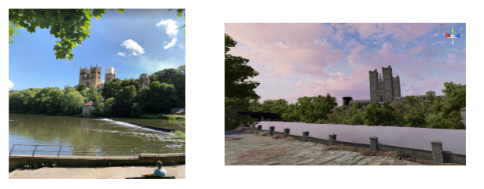
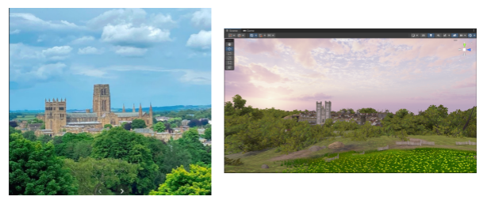
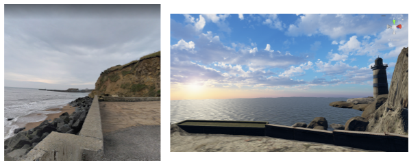

# Meditation-VR-system
The system is a VR meditation game for Oculus Quest 2, enhancing the experience through visualization and gamification, similar to Duolingo's tracking methods. It was developed in Unity with C#.

Download the installation zip file through the following link：[download](https://1drv.ms/u/s!AlAOIOBwskGHwUy_Bu1bl8ZEUVtv?e=MpsXrt)

User manual:[download](https://1drv.ms/b/s!AlAOIOBwskGHgl-hRuQVUO0tOqmA?e=486Uqq)

## 1.Scene1 Durham Riverside
Durham riverside is a place where people can walk by the river and enjoy the scenery of Durham  

  
## 2.Scene2 Observatory Hill
Observatory hill is a popular sightseeing spot in Durham where people can overlook the view of Durham Cathedral.  

  
## 3.Scene3 Seaham Beach
Seaham is a beach near Durham.  

